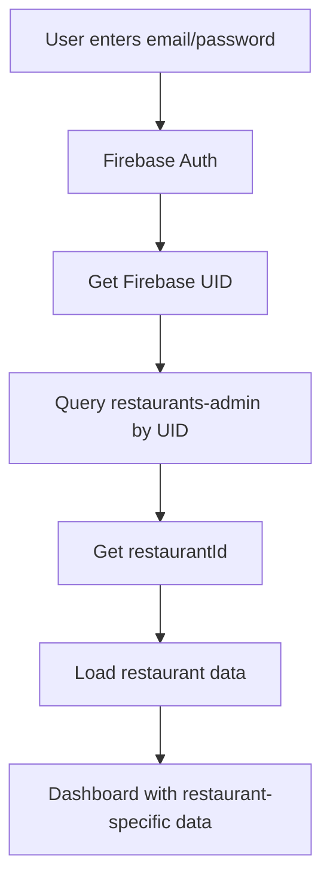

# 🔐 Authentication Structure Documentation

## Database Architecture

The MejaAR Admin Panel uses a **dual-collection authentication system** for secure restaurant management:

### Collections Structure

```
📁 restaurants/
├── the-spice-garden/          # Restaurant data
│   ├── name: "The Spice Garden"
│   ├── cuisine: "Indian"
│   ├── address: {...}
│   └── menuItems/             # Subcollection
│       └── categories/        # Subcollection

📁 restaurants-admin/
└── the-spice-garden/          # Admin credentials (same ID)
    ├── uid: "pQ1B6ZltXjfXmBZGHUHGBPJEAW53"
    ├── email: "demo@restaurant.com"
    ├── displayName: "The Spice Garden Admin"
    ├── restaurantId: "the-spice-garden"
    ├── role: "admin"
    └── permissions: {...}
```

## 🔑 How Authentication Works

1. **Restaurant Owner** logs in with email/password
2. **Firebase Auth** authenticates the user → returns Firebase UID
3. **System queries** `restaurants-admin` collection by Firebase UID
4. **Gets restaurant ID** from the admin document
5. **Admin can now manage** data in `restaurants/{restaurantId}/`

## 🧪 Demo Setup

### Current Demo User

- **Restaurant ID**: `the-spice-garden`
- **Email**: `demo@restaurant.com`
- **Password**: `demo123`
- **Role**: `admin` (full access)
- **Firebase UID**: `pQ1B6ZltXjfXmBZGHUHGBPJEAW53`

### Login Flow



## 🛠️ Setup New Restaurant Admin

### Method 1: Using Setup Script

```bash
# 1. Ensure restaurant exists in 'restaurants' collection
# 2. Run the setup script
npm run setup-demo

# Or manually:
node scripts/setup-demo-admin.js
```

### Method 2: Manual Setup

```javascript
// 1. Create Firebase Auth user
const userCredential = await createUserWithEmailAndPassword(
  auth,
  email,
  password
);
const firebaseUID = userCredential.user.uid;

// 2. Create admin document
await setDoc(doc(db, "restaurants-admin", restaurantId), {
  uid: firebaseUID,
  email: email,
  displayName: "Restaurant Admin Name",
  restaurantId: restaurantId,
  role: "admin",
  permissions: {
    manageMenu: true,
    manageProfile: true,
    viewAnalytics: true,
    manageStaff: true,
  },
  isActive: true,
  createdAt: serverTimestamp(),
});
```

## 🔐 Security Features

### Access Control

- ✅ **Restaurant Isolation**: Users only see their own restaurant data
- ✅ **Role-based Permissions**: Different access levels (admin/manager/staff)
- ✅ **Firebase UID Matching**: Secure linking between auth and restaurant
- ✅ **Document-level Security**: Firestore rules enforce data access

### Firestore Security Rules

```javascript
rules_version = '2';
service cloud.firestore {
  match /databases/{database}/documents {
    // Restaurants collection - read if active
    match /restaurants/{restaurantId} {
      allow read: if resource.data.isActive == true;
      allow write: if isAdminOfRestaurant(restaurantId);

      match /{subcollection=**} {
        allow read, write: if isAdminOfRestaurant(restaurantId);
      }
    }

    // Admin collection - only own data
    match /restaurants-admin/{restaurantId} {
      allow read, write: if isOwnerOfAdminDoc();
    }

    function isAdminOfRestaurant(restaurantId) {
      return request.auth != null &&
             get(/databases/$(database)/documents/restaurants-admin/$(restaurantId)).data.uid == request.auth.uid;
    }

    function isOwnerOfAdminDoc() {
      return request.auth != null &&
             resource.data.uid == request.auth.uid;
    }
  }
}
```

## 📊 Admin Dashboard Features

### What Admins Can Access

- ✅ **Restaurant Profile**: Edit name, description, hours, contact info
- ✅ **Menu Management**: Add/edit/delete menu items and categories
- ✅ **AR Models**: Upload and manage 3D models for menu items
- ✅ **Analytics**: View restaurant performance and popular items
- ✅ **Branding**: Customize restaurant colors and logos

### Role-based Permissions

```typescript
interface Permissions {
  manageMenu: boolean      // Add/edit menu items
  manageProfile: boolean   // Edit restaurant info
  viewAnalytics: boolean   // Access analytics dashboard
  manageStaff: boolean     // Add/remove staff members
}

// Default permission sets:
admin:   { all: true }
manager: { manageMenu: true, manageProfile: true, viewAnalytics: true }
staff:   { manageMenu: true }
```

## 🚀 Development Workflow

### Adding New Restaurant

1. Create restaurant document in `restaurants/` collection
2. Run setup script with restaurant ID
3. Provide login credentials to restaurant owner
4. Restaurant owner can now manage their digital presence

### Testing

```bash
# Start admin panel
npm run dev

# Visit: http://localhost:3001
# Login with: demo@restaurant.com / demo123
# Should see "the-spice-garden" restaurant data
```

### Production Deployment

1. Set up Firebase Auth in production
2. Deploy Firestore security rules
3. Create admin accounts for each restaurant
4. Provide secure login credentials

---

**✨ This structure ensures complete data isolation and security while providing a seamless management experience for restaurant owners!**
